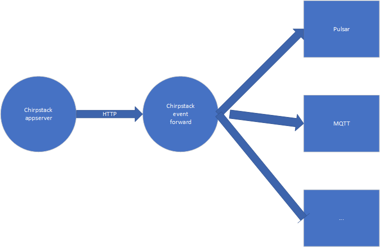

# chirpstack-event-forward  

[中文](README_zh.md)

chirpstack-event-forward是为了将chirpstack application server从HTTP集成方式转发出来的数据再次转发到更多的渠道.

目前已经支持的转发:  

- MQTT
- Pulsar


# 架构



# 部署

## Kubernetes

## Helm Chart  

使用的helm charet 来自 [chirpstack-event-forward](https://github.com/liangyuanpeng/charts/tree/main/chirpstack-event-forward).

前提条件：helm版本需要v3.

```
helm repo add lyp https://liangyuanpeng.github.io/charts
helm repo update
helm install lyp/chirpstack-event-forward
```

然后你就可以看到运行中的chirpstack-event-forward的pod了.  

```shell
$ kubectl get po
NAME                                            READY   STATUS    RESTARTS   AGE
cef-chirpstack-event-forward-7fd74f9966-q5nzb   1/1     Running   0          6m22s
```